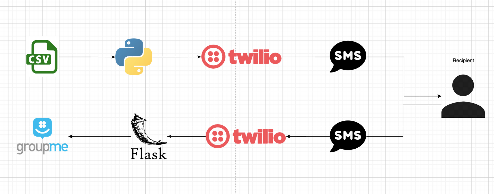
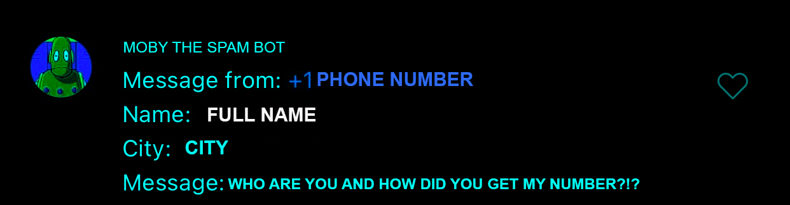

# Rushbot
A sketchy mass SMS system using Twilio and GroupMe APIs. 



Have you ever needed to implement a mass, bidirectional, SMS at scale, overnight, 
with $25 budget? Well this is the result of that situation. Rusbot was 
originally intended for fraternal recruitment purposes but can easily be 
adapted to critical communication infrastructure like Public Safety Alerts or 
Medical emergency hotlines. Your imagination and risk tolerance are truly the only limit!

Rushbot works in two parts: a cli for sending the initial mass text 
and a webserver for handling conversations. 

## SMS CLI

To send out a mass text run the following: 
```bash
python3 rushbot.py send_list.csv
```
where `send_list.csv` a csv with the following format:
```
firstName, lastName, phoneNumber
```
It will send a formatted message to every row in the csv using the 
recipients first name so they will at least read the message out 
of concern that some random person knows their name. This can be 
customized by changing the `msg_body` variable.

It's important that the phone number has an **american country** code. Rushbot 
is a **true patriot** and refuses to talk to non US numbers. 

## webserver

If you don't just want to shout into the void you might want to set up 
the webserver before running the cli. The webserver is a simple flask application
with two routs `/webhook` for receiving messages from twilio and forwarding them to 
a the groupMe API and `/callback` for forwarding messages from the groupMe API to 
the twilio api. After deploying the flask application it's important to keep 
the IP address supper secret because I never got around to implementing any sort 
of authentication protocol. Someone *could* potentially form a malicious post 
request and messages on your organizations behalf. 

Also remember to copy the csv you used to send out the mass text to the same 
directory as the flask application or Bingo won't know anyone's Nam-O  

## Responding to responses 
If someone responds to your mass sms it should pop up in your dedicated group message 
like this:



To reply to them simply reply like you normally would in a groupme group chat and it will 
it will start a message chain. 

- [Out dated blog post](https://notjoemartinez.com/blog/automated_sms_with_twilio_and_groupme/)
- **This is (mostly) a joke don't actually use this for anything important**

